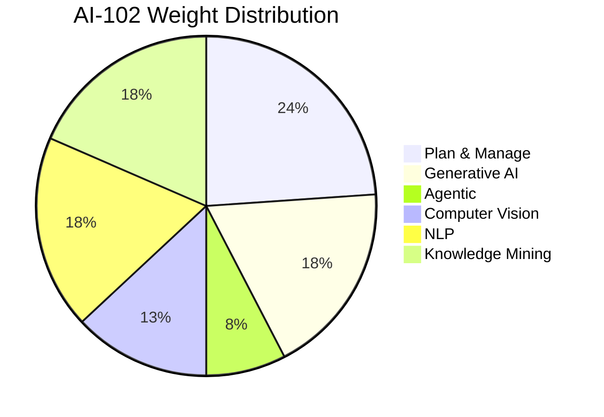
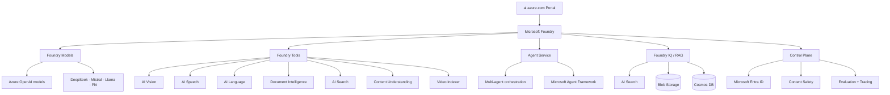

# AI-102 · Microsoft Azure AI Engineer Associate

> **⚠️ Exam AI-102 was retired on June 30, 2026** at 11:59 PM Central Standard Time. This study guide is preserved for **historical reference, portfolio, and job-market currency** — many job postings still reference "AI-102" or "Azure AI Engineer" as a target credential.
> Source: <https://learn.microsoft.com/en-us/credentials/certifications/resources/study-guides/ai-102>

---

## 🎯 Exam at a glance

| Field | Value |
|---|---|
| **Exam code** | AI-102 |
| **Title** | Designing and Implementing a Microsoft Azure AI Solution |
| **Level** | Associate |
| **Product** | Microsoft Azure (Microsoft Foundry) |
| **Roles** | Azure AI Engineer · Data Engineer · AI Developer |
| **Status** | ⚠️ **Retired 2026-06-30** |
| **Pass score** | 700 / 1000 |
| **Renewal** | Annual (free online assessment) |
| **Primary language** | English (others +8 weeks) |
| **Last updated** | 2025-12-23 (final exam version) |

---

## 🧠 Audience profile

> As a Microsoft Azure AI engineer, you build, manage, and deploy AI solutions that leverage Azure AI.

**Responsibilities** (full lifecycle):
- Requirements definition and design
- Development
- Deployment
- Integration
- Maintenance
- Performance tuning
- Monitoring

**Tools**:
- Python + C# (primary)
- REST APIs + SDKs
- Image processing, video processing, NLP, knowledge mining, generative AI

**Soft skills**: Translate architect's vision, collaborate with data scientists / data engineers / IoT specialists / infrastructure admins.

---

## 📊 Skills measured (6 functional groups)

| # | Functional group | Weight | Last updated |
|---|---|---|---|
| 1 | **Plan and manage an Azure AI solution** | **20–25%** | 2025-12-23 |
| 2 | **Implement generative AI solutions** | **15–20%** | 2025-12-23 |
| 3 | **Implement an agentic solution** | **5–10%** | 2025-12-23 (NEW) |
| 4 | **Implement computer vision solutions** | **10–15%** | 2025-12-23 |
| 5 | **Implement natural language processing solutions** | **15–20%** | 2025-12-23 |
| 6 | **Implement knowledge mining and information extraction** | **15–20%** | 2025-12-23 |



> **★ Most heavily weighted**: Plan/Manage (22%) + NLP (17%) + Knowledge Mining (17%) = 56% of exam.
> **★ New since last version**: "Implement an agentic solution" (5-10%) — reflects Microsoft Foundry Agent Service GA in 2025.

---

## 🗂 Sub-skills by functional group

### 1. Plan and manage an Azure AI solution (20-25%)

| Sub-skill | Topics |
|---|---|
| **Select the appropriate Microsoft Foundry Services** | GenAI · Vision · NLP · Speech · Information extraction · Knowledge mining |
| **Plan, create and deploy a Microsoft Foundry Service** | Responsible AI planning · Resource creation · Model selection · Deployment options · SDKs/APIs · Default endpoints · CI/CD integration · Container deployment |
| **Manage, monitor, and secure a Microsoft Foundry Service** | Monitor resource · Cost management · Account keys · Authentication |
| **Implement AI solutions responsibly** | Content moderation · Content safety insights · Filters + blocklists · Prompt shields + harm detection · Governance framework |

### 2. Implement generative AI solutions (15-20%)

| Sub-skill | Topics |
|---|---|
| **Build generative AI solutions with Microsoft Foundry** | Plan/prepare · Deploy hub + project + resources · Choose model · Prompt flow · RAG pattern · Evaluate models/flows · SDK integration · Prompt templates |
| **Use Azure OpenAI in Foundry Models to generate content** | Provision · Select/deploy · Submit prompts · DALL-E image gen · Integrate into app · Large multimodal models |
| **Optimize and operationalize a generative AI solution** | Generation parameters · Monitoring/diagnostics · Scalability + model updates · Tracing + feedback · Model reflection · Container deployment · Multi-model orchestration · Prompt engineering · Fine-tuning |

### 3. Implement an agentic solution (5-10%)

| Sub-skill | Topics |
|---|---|
| **Create custom agents** | Agent role/use cases · Resource config · Foundry Agent Service · Microsoft Agent Framework · Multi-agent workflows · Test/optimize/deploy |

### 4. Implement computer vision solutions (10-15%)

| Sub-skill | Topics |
|---|---|
| **Analyze images** | Visual features selection · Object detection + tags · Image analysis requests/responses · OCR (Azure Vision in Foundry Tools) · Handwriting conversion |
| **Implement custom vision models** | Classification vs detection · Labeling · Train custom · Evaluate metrics · Publish · Consume · Code-first |
| **Analyze videos** | Video Indexer insights · Spatial Analysis (presence/movement) |

### 5. Implement natural language processing solutions (15-20%)

| Sub-skill | Topics |
|---|---|
| **Analyze and translate text** | Key phrases + entities · Sentiment · Language detection · PII detection · Translate (Azure Translator in Foundry Tools) |
| **Process and translate speech** | GenAI speaking · TTS + STT (Azure Speech in Foundry Tools) · SSML improvement · Custom speech · Intent + keyword recognition · Speech-to-speech translation |
| **Implement custom language models** | Intents/entities/utterances · Train/evaluate/deploy/test LU model · Optimize/backup/recover · Consume from client · Custom Q&A · Multi-turn · Multi-language · Custom translation |

### 6. Implement knowledge mining and information extraction (15-20%)

| Sub-skill | Topics |
|---|---|
| **Implement an Azure AI Search solution** | Provision + create index + define skillset · Data sources + indexers · Custom skills · Run indexer · Query (syntax/sort/filter/wildcards) · Knowledge Store projections · Semantic + vector store |
| **Implement an Azure Document Intelligence in Foundry Tools solution** | Provision · Prebuilt models · Custom model · Train/test/publish · Composed models |
| **Extract information with Azure Content Understanding in Foundry Tools** | OCR pipeline · Summarize/classify/attributes · Extract entities/tables/images · Process documents/images/videos/audio |

---

## 📂 Reference documentation (10 crawled notes)

| # | Note | Size | One-line |
|---|---|---|---|
| 01 | `01-Reference-Docs/01-Azure-AI-Services-Overview` | 6.0 KB | Microsoft Foundry umbrella (Cognitive Services → AI Services → Foundry) |
| 02 | `01-Reference-Docs/02-Azure-AI-Vision` | 5.1 KB | Image analysis, OCR, custom vision models |
| 03 | `01-Reference-Docs/03-Azure-AI-Video-Indexer` | 5.2 KB | Video insights, spatial analysis |
| 04 | `01-Reference-Docs/04-Azure-AI-Language` | 5.9 KB | Text Analytics, CLU, Q&A, custom NLU |
| 05 | `01-Reference-Docs/05-Azure-AI-Speech` | 6.7 KB | STT, TTS, translation, custom neural voice |
| 06 | `01-Reference-Docs/06-Azure-AI-Search` | 7.1 KB | Classic + agentic retrieval, knowledge store |
| 07 | `01-Reference-Docs/07-Azure-OpenAI-Service` | 8.8 KB | OpenAI models on Azure (Foundry Models pivot) |
| 08 | `01-Reference-Docs/08-Azure-AI-Document-Intelligence` | 6.3 KB | Form Recognizer → Document Intelligence |
| 09 | `01-Reference-Docs/09-Plan-and-Prepare-Azure-AI-Development` | 6.7 KB | 1-hour 9-unit prep training module |
| 10 | `01-Reference-Docs/10-Azure-AI-Engineer-Certification-Overview` | 5.7 KB | Certification page + retirement notice |

---

## 🧭 Study resources (from official study guide)

| Resource | URL |
|---|---|
| Self-paced learning paths | <https://learn.microsoft.com/en-us/credentials/certifications/exams/AI-102#two-ways-to-prepare> |
| Azure AI services | <https://learn.microsoft.com/en-us/azure/ai-services/> (→ /azure/foundry/) |
| Azure AI Vision | <https://learn.microsoft.com/en-us/azure/cognitive-services/computer-vision/> |
| Azure AI Video Indexer | <https://learn.microsoft.com/en-us/azure/azure-video-indexer/> |
| Azure AI Language | <https://learn.microsoft.com/en-us/azure/cognitive-services/luis/> |
| Azure AI Speech | <https://learn.microsoft.com/en-us/azure/ai-services/speech-service/> |
| Azure AI Search | <https://learn.microsoft.com/en-us/azure/search/> |
| Azure OpenAI | <https://learn.microsoft.com/en-us/azure/ai-services/openai/> (→ /azure/foundry/) |
| Azure AI Document Intelligence | <https://learn.microsoft.com/en-us/azure/ai-services/document-intelligence/> |
| Microsoft Q&A | <https://learn.microsoft.com/en-us/answers/products/> |
| Tech Community (AI/ML) | <https://techcommunity.microsoft.com/t5/ai-machine-learning/bd-p/MachineLearning> |
| The AI Show | <https://learn.microsoft.com/en-us/shows/ai-show/> |

---

## ⚠️ Critical rebrand: "Cognitive Services" → "Foundry"

> All 10 reference doc URLs from the original study guide **redirect to new locations** as of 2026. The product family has been renamed **three times**:

```
Cognitive Services (2017)
       ↓
Azure AI Services (2023)
       ↓
Microsoft Foundry / Foundry Tools (2025)
       ↓
Foundry Models (separate brand for hosted LLMs, formerly Azure OpenAI Service)
```

| Old name | New name | Service |
|---|---|---|
| Cognitive Services → Computer Vision | **Azure AI Vision** in Foundry Tools | Image analysis, OCR |
| Cognitive Services → Language Understanding (LUIS) | **Azure AI Language** in Foundry Tools · **CLU** is the replacement (LUIS retired **2025-10-01**) | CLU, Q&A, Text Analytics |
| Cognitive Services → Speech | **Azure AI Speech** in Foundry Tools | STT, TTS, Translation |
| Cognitive Services → Form Recognizer | **Azure AI Document Intelligence** in Foundry Tools | Document extraction |
| Azure AI Video Indexer | **Azure AI Video Indexer** in Foundry Tools | Video insights |
| Azure AI Search | **Azure AI Search** in Foundry Tools | Cognitive Search |
| Azure AI Services (umbrella) | **Microsoft Foundry** (umbrella) | All of the above + Models + Agents + IQ |
| Azure OpenAI Service | **Foundry Models** (sold by Azure, with OpenAI pivot) | OpenAI GPT/DALL-E/embeddings |

> **★ Exam tip**: On the AI-102 exam, you will see all three brand names interchangeably. Know they refer to the same product family.

---

## 🗓 Change log (Dec 23, 2025)

| Skill area prior to Dec 23, 2025 | Skill area as of Dec 23, 2025 | Change |
|---|---|---|
| Plan and manage an Azure AI solution | Plan and manage an Azure AI solution | No change |
| Select the appropriate **Azure AI Foundry Services** | Select the appropriate **Microsoft Foundry Services** | Minor |
| Plan, create and deploy an **Azure AI Foundry Service** | Plan, create and deploy a **Microsoft Foundry Service** | Minor |
| Manage, monitor, and secure an **Azure AI Foundry Service** | Manage, monitor, and secure a **Microsoft Foundry Service** | Minor |
| Implement generative AI solutions | Implement generative AI solutions | No change |
| Build generative AI solutions with **Azure AI Foundry** | Build generative AI solutions with **Microsoft Foundry** | Minor |
| Use Azure OpenAI in Foundry Models | Use Azure OpenAI in Foundry Models | Minor |
| Implement an **agentic solution** | Implement an **agentic solution** | **NEW** (5-10%) |
| Create custom agents | Create custom agents | Minor |
| Implement computer vision solutions | Implement computer vision solutions | No change |
| Implement NLP solutions | Implement NLP solutions | No change |
| Implement knowledge mining and information extraction | Implement knowledge mining and information extraction | No change |
| Implement an Azure AI Document Intelligence solution | Implement an **Azure Document Intelligence in Foundry Tools** solution | Minor |
| Extract information with Azure AI Content Understanding | Extract information with **Azure Content Understanding in Foundry Tools** | Minor |

> **★ Bottom line**: The functional groups are stable, but the product branding was overhauled. New "agentic" sub-skill added.

---

## 🧠 Visual: Microsoft Foundry architecture



---

## 🛠 Exam-day reality (retired exam)

> **If you took AI-102 before 2026-06-30**: the certification is valid for **1 year from pass date**, then you must renew via free online assessment.
>
> **If you didn't take it**: the credential is no longer available. Microsoft's recommended successor is **Azure AI Foundry Engineer** (replacement cert not yet announced as of 2026-07-29 — watch the certification page).

For **portfolio + LinkedIn**, the AI-102 still demonstrates:
- Knowledge of the Microsoft Foundry ecosystem (the current production stack)
- Skills in 6 functional areas: Foundry planning, GenAI, Agentic, Vision, NLP, Knowledge Mining
- Familiarity with Azure-specific branding and SDK patterns

---

## 🔗 Related (across your vault)

- `../Vision/00 - Vision` _(external vault link) — your own Career vision doc
- `Profile` _(external vault link) — your background
- `Data Agent project` _(external vault link)
- `NLP-Learning` _(external vault link)
- `Resume` _(external vault link) — for showcasing this cert
- `Job Search 2026` _(external vault link)

---

<sub>Study guide content crawled 2026-07-29 · All 10 official reference docs saved with current 2026 names (Microsoft Foundry / Foundry Tools) and historical rebrand context. Source: <https://learn.microsoft.com/en-us/credentials/certifications/resources/study-guides/ai-102></sub>


---

<sub>📚 Source: Obsidian Vault snapshot from 2026-07-29. Part of the [AI-102 study pack](00 - AI-102 Study Guide.md). Exam AI-102 was retired 2026-06-30 — these notes are preserved for portfolio + Microsoft Foundry competency reference.</sub>
