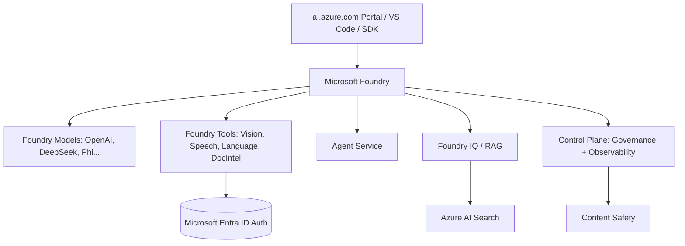

# Azure AI Services / Microsoft Foundry

> Microsoft Foundry (formerly "Azure AI Services", formerly "Cognitive Services") is the umbrella platform for building, deploying, and governing AI applications and agents at scale on Azure. It bundles pre-built AI capabilities (Foundry Tools), foundation models from OpenAI and partners (Foundry Models), an agent orchestration runtime (Foundry Agent Service), and a control plane for governance — all accessible via a unified portal (ai.azure.com), REST APIs, and SDKs in Python / C# / JS / Java.

## 🎯 Key Capabilities
- **Foundry Tools** — pre-built AI services for Vision, Speech, Language, Translator, Document Intelligence, Content Understanding, Face, Immersive Reader (each is a billable Azure resource with its own endpoint/key).
- **Foundry Models** — catalog of hosted models sold by Azure (OpenAI GPT, DeepSeek-R1, Mistral, Llama, Phi, etc.) with pay-as-you-go or provisioned deployment types.
- **Foundry Agent Service** — runtime to orchestrate, host, and share AI agents; integrates prompt agents, hosted agents, and Foundry IQ for knowledge grounding.
- **Foundry IQ** — knowledge-base grounding layer that connects enterprise data (Azure AI Search, Cosmos, Blob) to agents via retrieval-augmented generation.
- **Foundry Control Plane** — centralized governance for token limits, agent lifecycle management, observability/tracing, evaluation, and Content Safety enforcement.
- **Observability & Evaluation** — tracing for agent calls, dashboards for gen-AI apps, batch evaluation of agentic workflows, AI Red Teaming Agent.
- **Foundry Local** — runs open-source LLMs (HuggingFace, etc.) on-device / on-edge for free inference.

## 📦 Common Use Cases
- Customer-service copilots grounded on internal documentation (Foundry Agents + IQ).
- Image and document analysis pipelines in enterprise workflows (Vision + Document Intelligence).
- Multilingual speech-to-speech translation for contact centers (Speech + Translator).
- Content moderation on user-generated content (Content Safety).
- RAG applications combining OpenAI models with Azure AI Search indexes.
- Edge/on-prem LLM inference for low-latency or air-gapped scenarios (Foundry Local on Azure Local / Arc).

## 🔧 Service Tiers / SKUs (if applicable)
- **Standard (S0)** — pay-per-transaction, the default tier for nearly all Foundry Tools.
- **Free (F0)** — limited free quota for Vision / Language / Speech / Translator (used in quickstarts).
- **Provisioned / PTU** — reserved throughput for OpenAI / Foundry Models (predictable cost, low latency).
- **Connected / Disconnected containers** — Docker containers for Vision / Speech / Language / Translator for on-prem deployments.

## 🔌 Key APIs / SDK Methods (if shown)
| Area | Endpoint / Client |
|------|-------------------|
| Vision (Image Analysis 4.0) | `ImageAnalysisClient` (Python `azure-ai-vision-imageanalysis`) |
| Speech | `SpeechConfig`, `SpeechRecognizer`, `SpeechSynthesizer` (`azure-cognitiveservices-speech`) |
| Language | `TextAnalyticsClient`, `ConversationAuthoringClient` (`azure-ai-language`) |
| Document Intelligence | `DocumentIntelligenceClient` (`azure-ai-documentintelligence`) |
| Translator | `Translator` endpoint + `azure-ai-translation-text` |
| Content Safety | `ContentSafetyClient` (`azure-ai-contentsafety`) |
| OpenAI / Chat | `ChatCompletionsClient` (`azure-ai-inference` or `openai`) |

SDKs: **Python**, **C#**, **JavaScript/TypeScript**, **Java**. Foundry also offers an **MCP Server** and a **VS Code extension**.

## 🔗 Connections to Other Services
- **Azure AI Search** — knowledge store for RAG / Foundry IQ.
- **Azure Blob Storage / Cosmos DB / OneLake** — grounding data sources.
- **Azure Machine Learning** — model training, pipelines, AutoML.
- **Content Safety** — scanning prompts/responses before/after model calls.
- **Azure Arc / Azure Local** — edge deployment of Video Indexer and Foundry Local.
- **Microsoft Entra ID (AAD)** — authentication for all resource endpoints (key-based or Microsoft Entra token).

## ⚠️ Exam-Relevant Notes
- **Naming history** — Microsoft rebranded the stack twice: **Cognitive Services** (2017) → **Azure AI Services** (2023) → **Microsoft Foundry / Foundry Tools** (2025). On the retired AI-102 exam, expect to see all three names in case studies; know they refer to the same product family.
- The Foundry umbrella separates **Models** (you bring/host the LLM) from **Tools** (pre-built AI capabilities you call as APIs).
- All Foundry Tools resources use **multi-region endpoint pairs** and require a **region selection** when provisioned (pricing varies by region; check `azure.microsoft.com/global-infrastructure/services/?products=cognitive-services`).
- Authentication options: **API Key** (resource page) or **Microsoft Entra ID** (preferred for production / RBAC).
- Responsible AI: Foundry ships **Content Safety** and an **AI Red Teaming Agent** for safety evaluation.

## 🧠 Visual (optional, Mermaid)

## 📚 Source
- Original URL: https://learn.microsoft.com/en-us/azure/ai-services/
- Final URL after redirect: https://learn.microsoft.com/en-us/azure/foundry/

---

📚 Source: Obsidian Vault snapshot from 2026-07-29. Part of the [AI-102 study pack](../00 - AI-102 Study Guide.md). Exam AI-102 was retired 2026-06-30 — these notes are preserved for portfolio + Microsoft Foundry competency reference.
