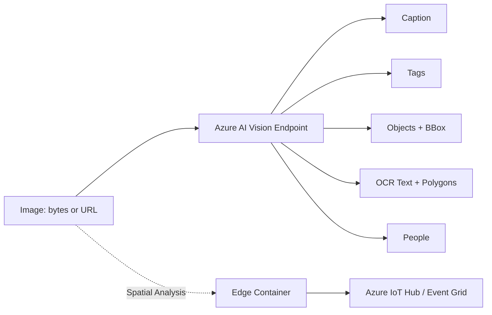

# Azure AI Vision

> Azure AI Vision (formerly "Computer Vision", a Foundry Tool) provides cloud-based algorithms that analyze image content. Submit an image (raw bytes or URL) and the service returns tags, captions, detected objects, OCR text, people/landmarks, and (via the Spatial Analysis add-on) real-time video analytics. Common in retail, media, accessibility, and document-digitization workloads.

## 🎯 Key Capabilities
- **Image Analysis 4.0** — single-call returns captions, dense captions, tags, objects, people, and OCR; choose features via the `features` parameter.
- **Optical Character Recognition (OCR)** — extract printed/handwritten text; supports 164+ languages; returns text lines + bounding-box polygons.
- **Image tagging** — returns a confidence-rated list of content tags (e.g. "indoor", "dog", "car").
- **Image captioning** — generates a natural-language sentence describing the image (neutral / accessible styles).
- **Object detection** — returns bounding boxes + class labels for detected objects.
- **Spatial Analysis** (video) — detects people/objects in live video streams; runs as an edge container.
- **Face detection** (limited) — basic attributes; full Face API lives at `/ai-services/face/` (separate, access-restricted resource).

## 📦 Common Use Cases
- **Product cataloging** — auto-tag and caption e-commerce product photos.
- **Document digitization** — OCR scanned forms into searchable text.
- **Accessibility** — generate alt-text for screen readers.
- **Content moderation** — flag adult/racy content (use **Content Safety** for that instead — Vision returns only "adult/gory" booleans).
- **Retail analytics** — Spatial Analysis to count people in-store zones (requires Azure IoT Edge).
- **Vehicle / landmark recognition** — domain-specific models return make/model or famous landmarks.

## 🔧 Service Tiers / SKUs (if applicable)
| Tier | Notes |
|------|-------|
| **Free (F0)** | 20 calls/min, 5K calls/month — quickstart/dev only |
| **Standard (S0)** | Pay-per-transaction; region-dependent pricing for Image Analysis vs OCR vs Spatial Analysis |
| **Container (Disconnected/Connected)** | Docker image for on-prem OCR / Spatial Analysis |

OCR Read v3.x and Image Analysis 4.0 are billed **per image / per feature**.

## 🔌 Key APIs / SDK Methods (if shown)
| Operation | SDK / REST |
|-----------|-----------|
| `analyze` (Image Analysis 4.0) | `ImageAnalysisClient().analyze(image, features=[...])` — Python `azure-ai-vision-imageanalysis` |
| Caption / Tags / Objects / People | `features=["caption","tags","objects","people"]` |
| OCR | `features=["read"]` → `ReadResult` with `blocks[].lines[].text` + polygon |
| Domain-specific | `model="products"`, `model="landmarks"`, `model="celebrities"` |
| REST | `POST {endpoint}/vision/v3.2/analyze?visualFeatures=...` |

SDKs: **Python**, **C#**, **Java**, **Node.js**.

## 🔗 Connections to Other Services
- **Content Safety** — preferred over Vision's `adult` flag for moderation.
- **Azure AI Search** — index extracted OCR text for full-text search.
- **Form Recognizer / Document Intelligence** — better than raw OCR for structured forms/invoices.
- **Storage Blob** — source of batch images (URL-based calls).
- **Custom Vision** — sibling service for training your own image classifier (now part of Vision Studio / Foundry).

## ⚠️ Exam-Relevant Notes
- **Naming history** — **Computer Vision** (Cognitive Services) → **Azure AI Vision** (AI Services) → **Vision (Foundry Tool)**. The REST endpoint namespace stayed `vision/v3.2` for backward compatibility.
- OCR Read API handles **printed + handwritten** text; returns **text + bounding polygon** + style info (handwritten/other).
- Image Analysis 4.0 returns **confidence scores (0–1)** and **bounding boxes** — use these for filtering.
- Spatial Analysis requires **Azure IoT Edge / Arc**; not a cloud-only service.
- **Face API is a SEPARATE resource** with limited access (Microsoft requires an intake form for facial recognition / identification / liveness).
- Service supports both **API Key** and **Microsoft Entra ID** authentication.

## 🧠 Visual (optional, Mermaid)

## 📚 Source
- Original URL: https://learn.microsoft.com/en-us/azure/cognitive-services/computer-vision/
- Final URL after redirect: https://learn.microsoft.com/en-us/azure/ai-services/computer-vision/

---

📚 Source: Obsidian Vault snapshot from 2026-07-29. Part of the [AI-102 study pack](../00 - AI-102 Study Guide.md). Exam AI-102 was retired 2026-06-30 — these notes are preserved for portfolio + Microsoft Foundry competency reference.
