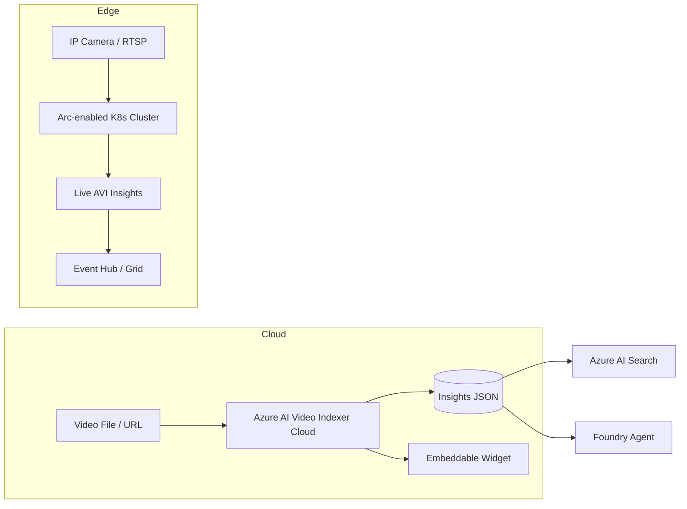

# Azure AI Video Indexer

> Azure AI Video Indexer (AVI) is a cloud **and** edge service that extracts rich insights from video and audio — transcripts, translation, sentiment, OCR-on-screen, face detection (limited), speaker identification, scene/shot segmentation, labels, and named entities. Two deployment options: a fully managed cloud SaaS, or **Video Indexer enabled by Azure Arc** for hybrid/edge/on-prem live analysis.

## 🎯 Key Capabilities
- **Speech transcription** — multi-speaker, multi-language; supports 50+ languages with auto language ID.
- **Translation** — translate the transcript into 50+ languages.
- **Sentiment analysis** — per-utterance positive/neutral/negative.
- **OCR** — text appearing on screen is extracted with timestamps.
- **Face detection / identification** — detects faces and can match against a custom **Person Model** (limited-access feature).
- **Speaker identification** — clusters who spoke when; named against a custom **Speaker Identification** model.
- **Scene / Shot detection** — visual scene changes and keyframe thumbnails.
- **Labels & Named Entities** — visual content tags, people, locations, organizations.
- **Audio effects** — identifies music, applause, silence, etc.
- **Live & near-real-time analysis** — via Arc-enabled edge deployment.

## 📦 Common Use Cases
- **Media & broadcast** — auto-generate archive metadata for searchable content libraries.
- **Enterprise compliance** — screen recorded meetings/calls for policy violations.
- **Sports & highlight reels** — auto-detect plays, score changes, crowd reactions.
- **Accessibility** — generate captions/subtitles and chapter markers.
- **Law-enforcement forensics** — evidence indexing (subject to Limited Access policy).
- **Real-time safety** — Arc edge deployment for detecting PPE / safety gear / equipment on factory floors.

## 🔧 Service Tiers / SKUs (if applicable)
| Tier / Mode | Notes |
|------|-------|
| **Cloud (managed)** | Pay-per-minute indexed; default SaaS |
| **Trial** | Free hours for evaluation (watermarked output) |
| **Arc-enabled (edge)** | Runs on Azure Arc-enabled Kubernetes cluster near the cameras |
| **Limited Access** | Face identification, celebrity identification, emotion detection require Microsoft approval |

## 🔌 Key APIs / SDK Methods (if shown)
- **Upload** — `POST {endpoint}/Accounts/{accountId}/Videos?name=...&videoUrl=...` (or multipart upload).
- **Get insights** — `GET /Accounts/{accountId}/Videos/{videoId}/Index` → JSON with `videos[].insights.transcript`, `faces`, `topics`, etc.
- **Get thumbnail** — `GET /Accounts/{accountId}/Videos/{videoId}/Thumbnails/{thumbnailId}`.
- **Embed widget** — iframe player that surfaces insights in a web UI.
- SDKs available; most integrations use the **REST API** directly. Widgets ship as **JS / React** components.

## 🔗 Connections to Other Services
- **Azure Media Services / Azure Blob Storage** — source video ingestion.
- **Azure Arc / Azure Kubernetes Service** — required for edge deployment.
- **Event Grid** — fires events on `JobStateChanged`, `InsightsFinished`.
- **Azure AI Search** — index AVI insights for natural-language search ("find the meeting where Bob said X").
- **Foundry Agent Service** — agent can call AVI as a tool to ground answers in video archives.

## ⚠️ Exam-Relevant Notes
- AVI is a **separate resource type** (not the same as Azure Media Services); you create an `Azure AI Video Indexer` account from the Azure Marketplace (it provisions a managed identity + storage + AMS account behind the scenes).
- **Two deployment modes** are an exam favorite: (1) **Cloud SaaS**, (2) **Arc-enabled** for edge.
- **Limited Access features** = restricted behind Microsoft's Responsible AI review (face ID, celebrity ID, emotion).
- AVI returns a **JSON insights document** with arrays for transcript lines, faces, topics, labels — exam questions often ask which field to read (e.g. `videos[0].insights.transcript[].text`).
- For **real-time / live streaming analysis** use the Arc deployment, not the cloud SaaS.
- **Person Model** (custom face identification) must be trained and assigned to the account before face identification works.

## 🧠 Visual (optional, Mermaid)

## 📚 Source
- Original URL: https://learn.microsoft.com/en-us/azure/azure-video-indexer/
- Final URL after redirect: https://learn.microsoft.com/en-us/azure/azure-video-indexer/ (no redirect observed — page served directly)

---

📚 Source: Obsidian Vault snapshot from 2026-07-29. Part of the [AI-102 study pack](../00 - AI-102 Study Guide.md). Exam AI-102 was retired 2026-06-30 — these notes are preserved for portfolio + Microsoft Foundry competency reference.
