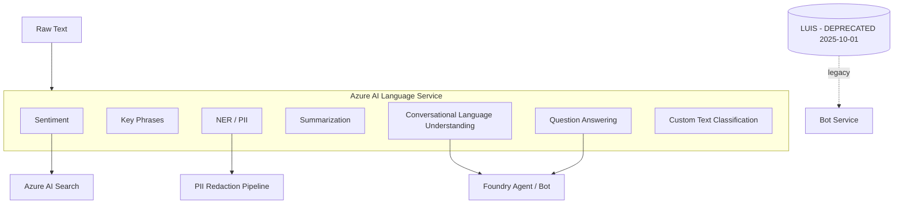

# Azure AI Language (and LUIS)

> Azure AI **Language** is the current Foundry Tool for NLP: sentiment, key phrases, entities, language detection, summarization, translation, and **Conversational Language Understanding (CLU)** — Microsoft's replacement for the now-deprecated **LUIS**. LUIS still works (Classic portal at `luis.ai`) but Microsoft retired it on **October 1, 2025**; new builds should use **CLU** (part of Language Service) or **Azure OpenAI / Foundry Agent Service** for intent-style tasks.

## 🎯 Key Capabilities
- **Sentiment Analysis & Opinion Mining** — per-sentence and per-aspect sentiment + targets.
- **Key Phrase Extraction** — pulls salient noun phrases.
- **Named Entity Recognition (NER)** — general + PII / redaction.
- **Language Detection** — auto-identify 125+ languages.
- **Summarization** — extractive and abstractive summaries of documents/conversations.
- **Question Answering** — extract answers from a knowledge base / unstructured docs.
- **Conversational Language Understanding (CLU)** — successor to LUIS; intents, entities, utterances, model training, deployment.
- **Custom Text Classification** — multi-label single-label classifiers you train on your own data.
- **Custom Named Entity Recognition (NER)** — train custom entity extractors.
- **Text Analytics for Health** — clinical/medical NER & relations.

## 📦 Common Use Cases
- **Customer-feedback analytics** — sentiment + key-phrase dashboards.
- **PII redaction** in transcripts and chat logs (Health & Financial entities).
- **Conversational AI** — CLU replaces LUIS for bot/agent intent parsing ("Book a flight to Tokyo").
- **Knowledge-base Q&A** — power chatbots from FAQs / docs.
- **Document summarization** — auto-summarize long emails / articles.
- **Content classification** — auto-route support tickets by topic.

## 🔧 Service Tiers / SKUs (if applicable)
| Tier | Notes |
|------|-------|
| **Free (F0)** | 5K transactions/month, used in quickstarts |
| **Standard (S0)** | Pay-per-record; per-feature pricing |
| **CLU authoring** | Free authoring; per-prediction pricing on S0 |
| **Custom Text Classification / NER** | Project-based; priced by training hours + prediction |

## 🔌 Key APIs / SDK Methods (if shown)
| Operation | Python SDK call |
|-----------|----------------|
| Analyze sentiment | `TextAnalyticsClient.analyze_sentiment(documents)` |
| Key phrases | `extract_key_phrases(documents)` |
| NER | `recognize_entities(documents)` |
| PII | `recognize_pii_entities(documents)` |
| Language | `detect_language(documents)` |
| Summarize | `begin_analyze_actions([AbstractiveSummarizationAction(...)])` |
| Q&A | `QnAMakerClient` / `question_answering` (project = knowledge base) |
| CLU | `ConversationAuthoringClient` (train + deploy) |
| LUIS (deprecated) | `LUISRuntimeClient` → `prediction.runtime.azurewebsites.net` |

SDKs: **Python** (`azure-ai-textanalytics`, `azure-ai-language-questionanswering`, `azure-ai-language-conversations`), **C#**, **JS**, **Java**.

## 🔗 Connections to Other Services
- **Bot Framework Composer / Bot Service** — historically used LUIS; now uses CLU or Foundry Agent Service.
- **Foundry Agent Service** — modern alternative; agents handle intent via foundation models instead of CLU.
- **Azure AI Search** — index extracted entities / summaries for RAG.
- **Speech Service** — pipeline Speech→Text→Language for voice bots.
- **Azure Blob Storage / Cosmos DB** — source data for Q&A / custom NER.

## ⚠️ Exam-Relevant Notes
- **Naming history** — **LUIS** (2017) → **Language Service / CLU** (2023) → **Language (Foundry Tool)** (2025). LUIS portal lives at `luis.ai`; documentation now at `previous-versions/azure/ai-services/luis/`.
- **LUIS retired Oct 1 2025.** On the (retired) AI-102 exam, expect questions on both LUIS **and** CLU — know that CLU uses **utterances, intents, entities** identical to LUIS, but training is done via `ConversationAuthoringClient` against an **Azure AI Language resource** (not a LUIS resource).
- LUIS concepts to remember: **Utterances** (training examples), **Intents** (the action), **Entities** (data extracted), **Phrase Lists** (boost features), **Prebuilt Domains**, **Batch Testing**.
- CLU adds **orchestration** — a single project can route among multiple apps (QnA, CLU, LUIS).
- **Endpoint keys** vs **Authoring keys**: authoring requires a separate key/role assignment.
- Knowledge of when to use **CLU vs Foundry Agent** is increasingly test-relevant — agents are preferred for new LLM-style conversational systems; CLU for deterministic, low-latency intent classification.

## 🧠 Visual (optional, Mermaid)

## 📚 Source
- Original URL: https://learn.microsoft.com/en-us/azure/cognitive-services/luis/
- Final URL after redirect: https://learn.microsoft.com/en-us/previous-versions/azure/ai-services/luis/ (LUIS docs moved to "previous-versions" archive — service retired)

---

📚 Source: Obsidian Vault snapshot from 2026-07-29. Part of the [AI-102 study pack](../00 - AI-102 Study Guide.md). Exam AI-102 was retired 2026-06-30 — these notes are preserved for portfolio + Microsoft Foundry competency reference.
