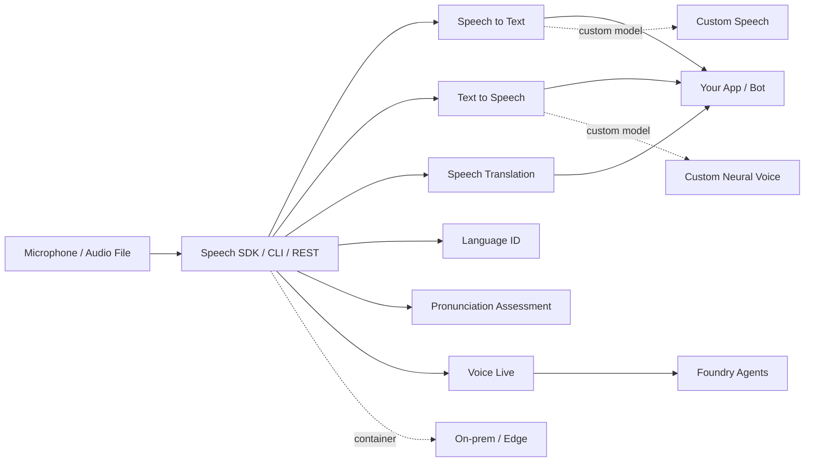

# Azure AI Speech

> Azure Speech (now branded **Azure Speech in Foundry Tools**) provides speech-to-text, text-to-speech, real-time speech translation, and live AI voice conversations as a fully managed cloud service, also available in containers for edge / on-prem deployment. Used by Microsoft internally for Teams captions, Office 365 dictation, and Edge Read Aloud, and by external customers for call centers, language learning, captioning, audiobooks, and conversational voice agents.

## 🎯 Key Capabilities
- **Speech to text** — real-time streaming transcription, fast transcription of pre-recorded audio, and batch transcription for large volumes; supports custom acoustic / language / pronunciation models for noisy or domain-specific audio.
- **Text to speech** — neural voices with SSML control over pitch, rate, volume, pronunciation; standard voice gallery plus private **custom neural voice** branding.
- **Text-to-speech avatar** — synthesizes a photorealistic digital video of a person speaking the input text, sync or async.
- **Speech translation** — real-time speech-to-speech and speech-to-text translation across many languages.
- **Language identification** — detect which language(s) are spoken in audio; usable standalone or chained with STT / translation.
- **Pronunciation assessment** — scores accuracy and fluency for language-learning apps.
- **Voice Live (formerly part of gpt-realtime / voice agents)** — low-latency speech-to-speech voice agent SDK for conversational AI experiences.
- **LLM speech (preview)** — LLM-enhanced STT / translation with better context understanding and prompt-tuning ("transcribe" and "translate" tasks).

## 📦 Common Use Cases
- Live captioning for meetings, streams, and accessibility (Teams-class captions).
- Call center transcription + sentiment / PII redaction for analytics.
- Audiobook / e-learning narration with neural voices.
- In-car navigation and voice assistants.
- Language learning apps with pronunciation scoring.
- Conversational voice agents / bots (Voice Live) for customer support.
- Synthetic video avatars for content creation or training.

## 🔧 Service Tiers / SKUs
Pricing is per-feature (STT, TTS, translation each have their own meter). Standard tiers are pay-as-you-go; committed-use tiers exist for high volume. Container SKUs are available for on-prem deployment for compliance. See the [Speech pricing page](https://azure.microsoft.com/pricing/details/cognitive-services/speech-services/) for current rates. Notable SKU axes:

| SKU axis | Options |
| --- | --- |
| Standard voice | Out-of-the-box neural voices (pay-as-you-go) |
| Custom voice | Private trained voice (limited access; responsible-AI gate) |
| Real-time STT | Streaming, billed per audio hour |
| Fast transcription | Pre-recorded audio, billed per audio hour |
| Batch transcription | Async, large volumes, per audio hour |
| Container | Disconnected / edge deployment, per-second billing |

## 🔌 Key APIs / SDK Methods
- **Speech SDK** — primary SDK in C#, C++, Go, Java, JavaScript, Objective-C/Swift, Python. Exposes `SpeechRecognizer`, `SpeechSynthesizer`, `TranslationRecognizer`, `VoiceLiveClient`.
- **Voice Live SDK** — newer low-latency SDK in C# / Python (Java/JS preview) for speech-to-speech agents.
- **Speech Transcription SDK** — Java / Python for high-quality transcription apps.
- **Speech CLI (`spx`)** — code-free command-line wrapper over most SDK features.
- **REST APIs** — speech-to-text, batch transcription, text-to-speech, custom voice, batch synthesis, batch avatar.
- **Speech Studio** — no-code UI for building projects, then reference assets via SDK / REST.

## 🔗 Connections to Other Services
- **Microsoft Foundry** — Speech is exposed as a **Foundry Tool**; surface via the **Speech MCP tool** to Foundry agents.
- **Azure OpenAI / Foundry Models** — multimodal speech inputs (GPT-4o audio) and LLM speech features.
- **Multimodal content** — ingestion into Azure AI Search for multimodal search.
- **Bot Service / Direct Line** — classic integration path for speech-enabled bots.
- **Sovereign clouds** — Azure Government, Azure operated by 21Vianet (China).
- **Containers** — run on Kubernetes, Azure Container Instances, or on-prem for disconnected scenarios.

## ⚠️ Exam-Relevant Notes
- **Naming history**: Cognitive Services Speech → Azure Speech → **Azure Speech in Foundry Tools** (current). The exam may still expect "Cognitive Services Speech" or "Azure Speech"; both refer to the same service.
- Custom Speech = acoustic + language + pronunciation training; needs Speech project in Speech Studio.
- Custom Neural Voice is **gated** — requires application and Microsoft's responsible-AI sign-off (limited access).
- **Three STT modes** matter for the exam: real-time (streaming), fast (pre-recorded, sync), batch (async, large). Know which to pick for a given scenario.
- Pronunciation Assessment is a discrete feature with its own SDK method (`PronunciationAssessmentConfig`) — language-learning scenario.
- Speech Translation returns interim + final results; uses `TranslationRecognizer`.
- Speech-to-text REST API current stable version is **2025-10-15** (migration guide published).
- Audio Content Creation = neural TTS for audiobooks / in-car nav; uses SSML.
- Containers are the answer when "data must stay on-prem" / "compliance" / "disconnected" scenarios come up.
- Speech is part of the **Foundry multi-service resource** — can share an endpoint with other Foundry Tools.

## 🧠 Visual

## 📚 Source
- Original URL: https://learn.microsoft.com/en-us/azure/ai-services/speech-service/
- Final URL: https://learn.microsoft.com/en-us/azure/ai-services/speech-service/ (no redirect)
- Overview page: https://learn.microsoft.com/en-us/azure/ai-services/speech-service/overview
- Last updated (per docs): 2026-01-30

---

📚 Source: Obsidian Vault snapshot from 2026-07-29. Part of the [AI-102 study pack](../00 - AI-102 Study Guide.md). Exam AI-102 was retired 2026-06-30 — these notes are preserved for portfolio + Microsoft Foundry competency reference.
