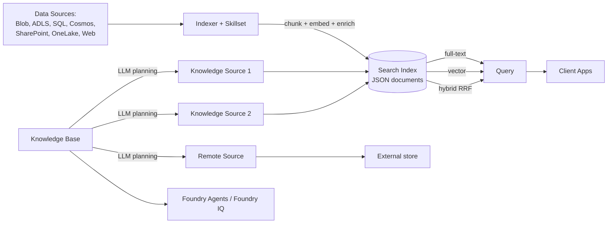

# Azure AI Search

> Azure AI Search (formerly **Azure Cognitive Search**, before that **Azure Search**) is a fully managed cloud search service that unifies full-text, vector, hybrid, and multimodal retrieval over your enterprise data. It powers both traditional index-based search and modern retrieval-augmented generation (RAG) via **agentic retrieval**, and underpins **Foundry IQ** — the knowledge layer for Microsoft Foundry agents.

## 🎯 Key Capabilities
- **Two retrieval engines**:
  1. **Classic search** — single-request, index-first, low-latency (no LLM in the loop).
  2. **Agentic retrieval** — multi-query, LLM-assisted planning + subquery decomposition + parallel retrieval + semantic reranking + merged response.
- **Query types** — full-text (Lucene-style inverted index), vector (similarity over embeddings), hybrid (RRF fusion of text + vector), multimodal (text + images in one pipeline), fuzzy, autocomplete, geo-spatial, filters.
- **Indexing** — JSON documents only; supports push (direct upload) or pull (indexer from a data source).
- **AI enrichment (skillsets)** — chunking, embedding generation, OCR, entity extraction, custom skills; the foundation of *cognitive search*.
- **Integrated vectorization** — built-in embedding + chunking at index or query time.
- **Remote knowledge sources** — query external stores (e.g. SharePoint, web) live without re-indexing.
- **Enterprise security** — Microsoft Entra auth, Azure Private Link, document-level access control, role-based access, security filters.
- **Relevance tuning** — scoring profiles, semantic ranker, synonyms, faceted navigation.

## 📦 Common Use Cases
- Enterprise search apps (intranet, document libraries).
- RAG pattern for chatbots / agents grounded on private data.
- E-commerce product search with filters and faceting.
- Knowledge mining pipelines that ingest blobs, extract entities, and serve an index.
- Multimodal search across PDFs containing text + images.
- Permission-aware agentic RAG over SharePoint, OneLake, Blob Storage, Cosmos DB.

## 🔧 Service Tiers / SKUs
Two pricing models are now offered:

| Pricing model | Billing unit | Best for |
| --- | --- | --- |
| **Dedicated** | Search Units (SUs) per hour + storage | Predictable, high-utilization, steady workloads |
| **Serverless (Preview)** | Compute Units per hour (CU/hr) + per-GB indexed storage | Bursty, variable, infrequent workloads |

Within **Dedicated**, classic tiers from low to high: Free, Basic, S1, S2, S3, plus higher-capacity tiers. Replicas (read scale) and partitions (write scale / storage) are configurable independently. Storage is fixed per partition.

> **Exam legacy**: AI-102 was written against the older S1/S2/S3/Storage-Optimized tier names. The concepts still map — replicas = query throughput, partitions = index storage and write throughput.

## 🔌 Key APIs / SDK Methods
- **REST API** — `https://<service>.search.windows.net/` with versioned API versions (e.g. `2024-05-01-preview`).
- **Azure SDKs** — `@azure/search-documents` for Python, JavaScript, Java, .NET.
- **Key REST surfaces**:
  - `Indexes` — create/update/delete index (schema with fields, suggesters, scoring profiles, semantic config).
  - `Indexers` — pull data from sources, run skillsets, write to index.
  - `Skillsets` — cognitive skill pipeline (OCR, split, embed, custom Web API skill).
  - `Data Sources** — connection info for indexers.
  - `Documents` — upload/merge/delete/lookup (`@search.action`, `search=`, `vector=`, `select=`, `filter=`).
  - `Knowledge Bases` + `Knowledge Sources` — for agentic retrieval.
  - `Suggesters` / `Autocomplete`.
- **Search Explorer** — built-in panel in Azure portal for ad-hoc queries.

## 🔗 Connections to Other Services
- **Microsoft Foundry (Foundry IQ)** — Search is the managed knowledge layer for Foundry agents; knowledge bases attach to agents.
- **Azure OpenAI / Foundry Models** — provides grounding content for LLMs; embeddings model integration for vector indexing.
- **Data sources** — Azure Blob Storage, Azure Data Lake Storage Gen2, Azure SQL, Cosmos DB, SharePoint, OneLake, and web URLs.
- **Azure AI Foundry SDKs** — full programmatic access for orchestration.
- **Logic Apps** — can drive indexers / data ingestion workflows.
- **Azure Machine Learning** — custom skills deployed as web services can run inside skillsets.

## ⚠️ Exam-Relevant Notes
- **Naming history**: Azure Search → Azure Cognitive Search → **Azure AI Search** (current). The exam will accept both "Cognitive Search" and "AI Search" answers.
- **Classic search** vs **agentic retrieval** — know the difference:
  - Classic: one query, one index, no LLM in the loop, returned ranked documents.
  - Agentic: knowledge base → LLM plans → multiple subqueries → parallel retrieval → semantic reranking → synthesized answer with activity log + references.
- **Skillsets** = the "cognitive" piece: OCR, split, entity recognition, key-phrase extraction, language detection, custom Web API skill, plus embedding generation for vectors.
- **Indexer pattern** — schedule-driven, change-tracking-aware pull from supported data sources; output to an index.
- **Integrated vectorization** builds embedding into the indexer pipeline so you don't have to embed offline.
- **Hybrid search** uses Reciprocal Rank Fusion (RRF) to combine BM25 text + vector results.
- **Semantic ranker** is a separate, billable add-on that re-ranks top results using a deeper model.
- **Security trimming** — `search.in` filter on allowed IDs is the standard workaround for document-level ACL; remote SharePoint is the exception that natively inherits.
- **Foundry IQ** is the new enterprise knowledge layer that wraps Search for agent scenarios.
- **SLA** — applies to the Dedicated tier; preview tiers (e.g. Serverless Developer) have no SLA.

## 🧠 Visual

## 📚 Source
- Original URL: https://learn.microsoft.com/en-us/azure/search/
- Final URL: https://learn.microsoft.com/en-us/azure/search/ (no redirect)
- Overview page: https://learn.microsoft.com/en-us/azure/search/search-what-is-azure-search
- Last updated (per docs): 2026-06-02

---

📚 Source: Obsidian Vault snapshot from 2026-07-29. Part of the [AI-102 study pack](../00 - AI-102 Study Guide.md). Exam AI-102 was retired 2026-06-30 — these notes are preserved for portfolio + Microsoft Foundry competency reference.
