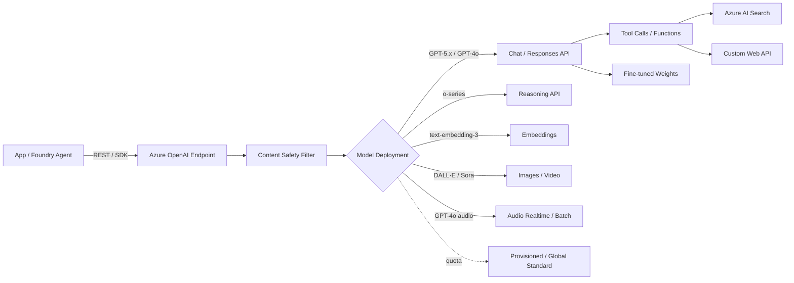

# Azure OpenAI Service

> Azure OpenAI Service provides REST API access to OpenAI's GPT, Codex, embedding, image, audio, and reasoning models hosted on Azure infrastructure. It is now a subset of **Microsoft Foundry Models** ("Foundry Models sold by Azure"), unified under the Microsoft Foundry portal at `ai.azure.com`. The legacy `azure/ai-services/openai/` docs URL redirects to `/azure/foundry/`.

## ⚠️ URL REDIRECT — read this first
The original study-guide URL `https://learn.microsoft.com/en-us/azure/ai-services/openai/` **redirects** to the Microsoft Foundry hub at `https://learn.microsoft.com/en-us/azure/foundry/`. The Azure OpenAI-specific content now lives under the Foundry Models catalog at `/azure/foundry/foundry-models/concepts/models-sold-directly-by-azure` (with the `?pivots=azure-openai` pivot). The data, control plane, and feature set are unchanged — only the documentation surface was consolidated.

## 🎯 Key Capabilities
- **Chat / text generation** — GPT-5.x series, GPT-4.1, GPT-4o, GPT-4 Turbo; supports system prompts, structured outputs, function/tool calling, and parallel tool calls.
- **Reasoning models (o-series)** — `o1`, `o3`, `o4-mini`, `codex-mini` for advanced problem solving; use the Responses API for the latest reasoning features.
- **Embeddings** — `text-embedding-3-large`, `text-embedding-3-small`, `text-embedding-ada-002` for vector representations used by AI Search, RAG, similarity.
- **Image generation** — DALL·E 3 and later image models, called via the Images API.
- **Video generation** — `sora-2` (Foundry Models sold by Azure).
- **Audio** — GPT-4o audio models with speech-in / speech-out, low-latency conversational interactions, and audio generation.
- **Fine-tuning** — supervised fine-tuning and (for some models) RLHF / DPO on your own data.
- **Content filtering / Responsible AI** — built-in Content Safety integration (prompt shields, jailbreak detection, harmful content categories).
- **Provisions and quota** — per-region, per-model deployment types (Standard, Global Standard, Provisioned, Reserved, Batch, etc.).

## 📦 Common Use Cases
- Chatbots, copilots, and RAG over enterprise data (usually paired with Azure AI Search).
- Code generation / explanation (Codex, GPT-5.x-codex).
- Document summarization, extraction, classification.
- Embeddings for semantic search, clustering, recommendations.
- Image generation for marketing, design, content.
- Speech-to-speech voice agents via GPT-4o audio or Voice Live.
- Automated reasoning / planning with o-series models.
- Function-calling agents that invoke external tools / APIs.

## 🔧 Service Tiers / SKUs (Deployment Types)
Azure OpenAI uses **deployments** of a specific model. Each deployment has a deployment type that governs pricing & throughput:

| Deployment type | Description | Best for |
| --- | --- | --- |
| **Standard** | Pay-per-token, regional capacity | Default, low-latency production |
| **Global Standard** | Pay-per-token, dynamically routed across Azure regions | High throughput, bursty traffic |
| **Data Zone Standard** | Pay-per-token, routed within a data zone (EU / US) | Data-residency at zone level |
| **Provisioned (PTU)** | Reserved throughput units, monthly commit | Predictable high-volume production |
| **Reserved** | 1- or 3-year reservation discount on PTUs | Long-term steady capacity |
| **Batch** | Async, 24-hr SLA, lower cost | Long-running, non-interactive jobs |
| **Global Provisioned / Global Batch** | Cross-region / async variants | Global scale, async processing |

> **Exam legacy**: AI-102 was written against the older model names (GPT-3.5, GPT-4, GPT-4 Turbo, embeddings-ada-002, DALL·E 3). The newer GPT-5.x, o-series, gpt-oss, and Sora families are Foundry-era additions; you still need to know the *patterns* (chat completions, embeddings, DALL·E, fine-tuning, content filtering).

## 🔌 Key APIs / SDK Methods
- **Chat Completions API** (`/chat/completions`) — primary text-generation endpoint. Supports `messages`, `tools`, `response_format`, `temperature`, `max_tokens`.
- **Responses API** — newer unified endpoint combining chat completions + tool calls + state; preferred for reasoning models and agentic flows.
- **Embeddings API** (`/embeddings`) — vector representations.
- **Images API** (`/images/generations`, `/images/edits`) — DALL·E.
- **Video API** — Sora.
- **Audio API** — speech-to-text, text-to-speech, audio generation (realtime + batch).
- **Fine-tuning API** — `POST /fine_tuning/jobs` for supervised fine-tuning.
- **Assistants API** (now superseded by Foundry Agent Service) — thread/run, code interpreter, file search, function calling.
- **Azure OpenAI SDKs** — `openai` Python library pointed at Azure endpoint, plus `@azure/openai` / `Azure.AI.OpenAI` (C# / Java / JS).
- **Foundry SDK** — unified SDK for all Foundry Models including OpenAI family.

## 🔗 Connections to Other Services
- **Microsoft Foundry** — primary home; Azure OpenAI is now a Foundry Model `kind`.
- **Foundry Agent Service** — wrap OpenAI models in hosted agents with tool calls, threads, knowledge bases.
- **Azure AI Search** — typical RAG pairing: Search retrieves, OpenAI generates.
- **Content Safety** — every chat-completions call passes through Content Safety filters by default.
- **Azure Blob Storage / OneLake** — feed fine-tuning datasets and Assistants file_search.
- **Azure AI Services multi-service resource** — historically could share an endpoint; modern recommendation is a dedicated Foundry resource.
- **Logic Apps / Functions / APIM** — wrap OpenAI calls with governance, caching, and token budgets.

## ⚠️ Exam-Relevant Notes
- **Naming history**: Azure OpenAI Service → Azure OpenAI in Foundry → **Foundry Models sold by Azure** (current). Older docs calls it "Azure OpenAI"; the exam will still use that name.
- **Resource type** in ARM: `Microsoft.CognitiveServices/accounts` with `kind=OpenAI` (or Foundry equivalent). Deployment is a child resource.
- **Provisioning** — OpenAI access historically required a form / application; that gate is now relaxed for most accounts but high-rate-limit tiers may still need approval.
- **Authentication** — Microsoft Entra (recommended) **or** API key. Always prefer Entra in production.
- **Content filters** — built-in, configurable (input + output filters per category). Prompt Shields detect jailbreak / indirect prompt injection.
- **Token limits** — every model has a **context window** (input + output) and a separate **max output tokens**. Reasoning tokens count against the context budget.
- **Responsible AI** — system messages, content filtering, abuse monitoring, and the limited-access form for fine-tuning of restricted models.
- **Fine-tuning** — supports upload JSONL dataset; base model governance requires Microsoft approval for some models.
- **Assistants API vs Foundry Agent Service** — Assistants is legacy; **Foundry Agent Service** is the current preferred path for threads + tools + knowledge.
- **Embeddings** — `text-embedding-3-*` are the current flagships; `ada-002` is still supported. Dimensionality is configurable for v3.
- **PTU math** — exam may ask when to pick Provisioned vs PayGo; high + predictable = PTU, bursty = PayGo / Global Standard.
- **Data residency** — Standard is regional; Global Standard routes dynamically; Data Zone Standard keeps data in a named zone (EU / US).

## 🧠 Visual

## 📚 Source
- Original URL: https://learn.microsoft.com/en-us/azure/ai-services/openai/
- Final URL (after redirect): https://learn.microsoft.com/en-us/azure/foundry/
- Azure OpenAI-specific docs (post-redirect canonical): https://learn.microsoft.com/en-us/azure/foundry/foundry-models/concepts/models-sold-directly-by-azure?pivots=azure-openai
- Foundry Models catalog last updated (per docs): 2026-07-23

---

📚 Source: Obsidian Vault snapshot from 2026-07-29. Part of the [AI-102 study pack](../00 - AI-102 Study Guide.md). Exam AI-102 was retired 2026-06-30 — these notes are preserved for portfolio + Microsoft Foundry competency reference.
