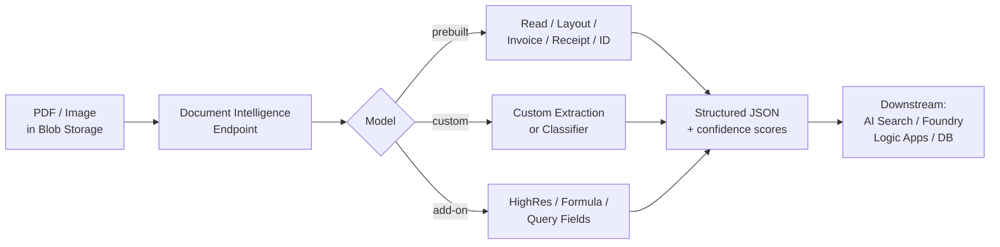

# Azure Document Intelligence in Foundry Tools

> Azure Document Intelligence is a cloud-based Microsoft Foundry tool (formerly Azure AI Document Intelligence, formerly Form Recognizer) that uses machine-learning models to automate data extraction from documents in applications and workflows. It is essential for enhancing data-driven strategies and enriching document search capabilities, and is consumed by developers building document automation into apps or by knowledge-mining pipelines that need structured output from unstructured PDFs/images.

## 🎯 Key Capabilities
- **Prebuilt models** for common document types: Read (OCR + handwriting), Layout (structure, tables, figures), Financial Services & Legal, US Tax, and Personal Identification.
- **Custom extraction models** — train on your own labeled forms to extract domain-specific key-value pairs and fields.
- **Custom classification models** — train a classifier to route documents to the right extraction model or workflow.
- **Query field extraction** — extract specific fields on demand at inference time, without retraining the model.
- **Add-on capabilities** — optional features (e.g., high-resolution, formula, font property extraction) layered onto prebuilt or custom models.
- **Batch document analysis** — submit many documents in one request for async processing.
- **Retrieval-Augmented Generation (RAG)** support — clean structured output that drops cleanly into vector indexes / Foundry vector search.
- **Confidence and accuracy scores** returned with every prediction, for downstream gating.
- **Multiple deployment options** — cloud endpoint, or Docker **container** for disconnected/edge use.

## 📦 Common Use Cases
- Automated invoice / receipt processing (AP automation).
- Contract and legal-document clause extraction.
- Identity document verification (passports, driver's licenses, US tax forms).
- Mortgage / loan application form processing.
- Knowledge mining over enterprise document archives (PDF library → search index).
- RAG preprocessing — converting unstructured PDFs into clean chunks + metadata for vector search.

## 🔧 Service Tiers / SKUs
| Tier | Use | Notes |
|---|---|---|
| **Free (F0)** | Dev / eval | Limited monthly pages, no SLA |
| **Standard (S0)** | Production | Pay-per-page, regional, SLA-backed |
| **Container (disconnected)** | On-prem / edge | Bring-your-own infra, license per container |

Pricing is per-page for both prebuilt and custom models, with separate metering for add-on capabilities. Document Intelligence is provisioned as a single-resource service (one endpoint per resource).

## 🔌 Key APIs / SDK Methods
- `POST /documentModels/{modelId}:analyze` — start an analysis job (returns `Operation-Location`).
- `GET /documentModels/{modelId}:analyze/{resultId}` — poll for results.
- **Studio** at `documentintelligence.ai.azure.com` for no-code labeling, training, and testing.
- SDKs: **Python**, **.NET (C#)**, **JavaScript/TypeScript**, **Java**.
- Auth: API key, Microsoft Entra ID (managed identity supported for storage access).
- Input formats: PDF, JPEG/JPG, PNG, BMP, TIFF, HEIF; Office files via Office conversion.

## 🔗 Connections to Other Services
- **Azure Blob Storage** — typical source of documents (read via SAS token or managed identity).
- **Azure AI Search / Foundry vector search** — RAG downstream of extraction.
- **Azure OpenAI / Foundry Models** — used in RAG pipelines over extracted content.
- **Logic Apps / Functions / Data Factory** — orchestration and ETL of document batches.
- **Microsoft Entra ID** — authentication and managed-identity access to storage.

## ⚠️ Exam-Relevant Notes
- **Name evolution** (definitely on legacy exam material): **Form Recognizer** → **Azure AI Document Intelligence** → **Azure Document Intelligence in Foundry Tools** (current branding). All three refer to the same service.
- It is a **Foundry Tool** (the new umbrella for what used to be "Azure AI Services" / "Cognitive Services"). The branding is `Cognitive Services → Azure AI Services → Foundry Tools`.
- Know the difference between **prebuilt** (Read, Layout, prebuilt invoice/receipt/ID) and **custom** (extraction & classification) models — exam scenarios will pick one.
- **Layout** model is the workhorse: extracts text, tables, selection marks, figures, and structure — useful for RAG preprocessing and any "give me structured JSON from this PDF" scenario.
- **Read** model = OCR + handwriting (the "next-generation" OCR; replaces older Recognize Text).
- Custom models require a labeled training set in the Studio; compose models let you group multiple custom models behind one endpoint.
- For AI-102: recognize the four core Azure AI solution areas (vision, speech, language, decision) and where Document Intelligence fits (knowledge mining + information extraction).
- **Version note** (current docs, 2026): the **v3.0 API retires March 30, 2029** — exam-scenarios may reference v3.0 → v4.0 migration.

## 🧠 Visual

## 📚 Source
- Original URL: https://learn.microsoft.com/en-us/azure/ai-services/document-intelligence/
- Final URL (after `?view=doc-intel-4.0.0` redirect): same path with `?view=doc-intel-4.0.0` appended
- Note: page now brands as "Azure Document Intelligence in Foundry Tools documentation" (was "Azure AI Document Intelligence documentation" pre-Foundry rebrand)

---

📚 Source: Obsidian Vault snapshot from 2026-07-29. Part of the [AI-102 study pack](../00 - AI-102 Study Guide.md). Exam AI-102 was retired 2026-06-30 — these notes are preserved for portfolio + Microsoft Foundry competency reference.
