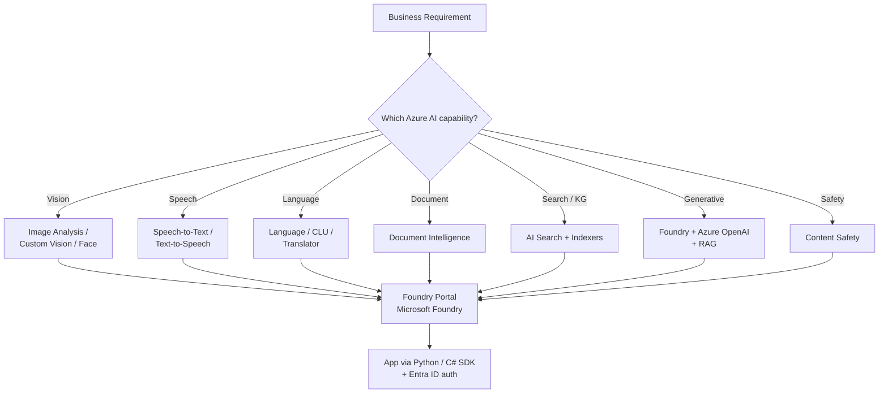

# Plan and Prepare to Develop AI Solutions on Azure

> This is the **first module in the AI-102 learning path** ("Develop generative AI apps in Azure"). It is a 1-hour, 9-unit beginner module that gives you the mental model for the whole exam: what AI capabilities Azure offers, what Microsoft Foundry and Foundry Tools are, which SDKs you use, and what responsible-AI rules apply. If you only read one piece of Microsoft Learn before the exam, read this one.

## 🎯 Key Capabilities (Learning Objectives)
By the end of this module you should be able to:
- Identify common AI capabilities you can implement in applications
- Describe **Microsoft Foundry** and considerations for using it
- Describe **Foundry Tools** and considerations for using them
- Identify appropriate developer tools and SDKs for an AI project
- Describe considerations for **responsible AI**

## 📦 Module Structure (9 units, ~1 hour)
| # | Unit | Length |
|---|---|---|
| 1 | Introduction | 1 min |
| 2 | What is AI? | 5 min |
| 3 | Foundry Tools (covers Azure AI Services family) | 5 min |
| 4 | Microsoft Foundry (the portal / hub) | 5 min |
| 5 | Developer tools and SDKs | 5 min |
| 6 | Responsible AI | 5 min |
| 7 | Exercise — Prepare for an AI development project | 30 min |
| 8 | Module assessment (knowledge check) | 3 min |
| 9 | Summary | 1 min |

**Reward:** 1000 XP, generic badge. Module authored with assistance from AI (per the disclosure at the bottom of the page).

## 🔧 The Big Idea (what an AI-102 candidate must internalize)
### AI capability categories
The module frames Azure AI in terms of common capabilities you'll bolt into an app:
- **Machine learning** (custom models, Azure ML)
- **Anomaly detection** (Univariate / Multivariate in Foundry Tools)
- **Computer vision** (Image Analysis, Custom Vision, Face, Document Intelligence)
- **Natural language processing** (Language service: sentiment, NER, translation, CLU/LUIS)
- **Speech** (Speech to Text, Text to Speech, Speaker Recognition, Translation)
- **Knowledge mining + information extraction** (Document Intelligence, AI Search)
- **Generative AI** (Foundry / Azure OpenAI, prompt flow, RAG)

### Microsoft Foundry (the hub)
- Unified **portal** for building, evaluating, deploying generative-AI and traditional AI solutions.
- Hosts **Foundry projects** where you assemble models, data, indexes, and evaluation flows.
- Replaces / subsumes older "AI Studio" and "Azure ML Studio" experiences.

### Foundry Tools (the API services)
- The new umbrella brand for what was **Azure AI Services**, which was itself the rename of **Cognitive Services**.
- Discrete REST + SDK services you call from your app: Vision, Language, Speech, Document Intelligence, Content Safety, Translator, etc.
- Each tool is provisioned as its own resource (or grouped under a multi-service resource) and accessed via an endpoint + key (or Microsoft Entra ID).

### Developer tools & SDKs
- **Languages**: Python and C# are the two the cert page calls out by name; the exam assumes comfort in one of them.
- **SDKs**: per-service SDKs (e.g. `azure-ai-documentintelligence`, `azure-ai-vision-imageanalysis`, `azure-ai-inference`) plus the older `azure-cognitiveservices-*` legacy SDKs.
- **REST**: every Foundry Tool has a REST API — you should be comfortable reading a `curl` snippet and the `Ocp-Apim-Subscription-Key` / `Authorization: Bearer` headers.
- **Tooling**: VS Code + AI Foundry extension, Azure CLI (`az`), VS / Visual Studio, GitHub Codespaces.

### Responsible AI
- Six Microsoft principles: **fairness, reliability & safety, privacy & security, inclusiveness, transparency, accountability**.
- Practical implications on the exam: choosing the right Foundry Tool for a sensitive use case, content filtering via **Azure AI Content Safety**, transparency notes, data residency.

## 🔌 Connections to Other Services
- **Microsoft Foundry** ← hosts / orchestrates Foundry Tools and Foundry model deployments.
- **Foundry Tools** ← consumed from your app via SDK or REST.
- **Azure OpenAI** ← typically surfaced inside Foundry projects; not a "Foundry Tool" per se (it's a model-deployment service), but adjacent.
- **Azure AI Search** ← common companion for RAG patterns over extracted documents.
- **Microsoft Entra ID** ← auth for the SDKs and for managed-identity access to data sources.

## ⚠️ Exam-Relevant Notes
- **Branding chain** (high-yield trivia): **Cognitive Services → Azure AI Services → Foundry Tools**. The "AI services" hub is now the **Foundry** portal; individual services are **Foundry Tools**.
- For AI-102 you should be able to **map a business requirement to the right tool**:
  - "extract fields from invoices" → Document Intelligence
  - "summarize call-center audio" → Speech-to-Text + Language
  - "build a chat assistant over our docs" → Foundry + Azure OpenAI + AI Search (RAG)
  - "moderate user-generated content" → AI Content Safety
  - "detect objects in product photos" → Image Analysis / Custom Vision
- Know the difference between **Foundry** (the platform/portal) and **Foundry Tools** (the individual AI services) — exam scenarios will mix the terms.
- Auth: API key vs Microsoft Entra ID vs **managed identity** (preferred for apps accessing storage / AI Search).
- This module is part of the **"Develop generative AI apps in Azure"** learning path — which lines up with the AI-102 domain *Implement generative AI solutions*.

## 🧠 Visual

## 📚 Source
- Original URL: https://learn.microsoft.com/en-us/training/modules/prepare-azure-ai-development/
- Final URL: same (no redirect)
- Part of learning path: "Develop generative AI apps in Azure" (https://learn.microsoft.com/training/paths/develop-generative-ai-apps/)
- Level: Beginner · Role: AI Engineer · XP: 1000 · Units: 9 · Time: ~1 hr

---

📚 Source: Obsidian Vault snapshot from 2026-07-29. Part of the [AI-102 study pack](../00 - AI-102 Study Guide.md). Exam AI-102 was retired 2026-06-30 — these notes are preserved for portfolio + Microsoft Foundry competency reference.
