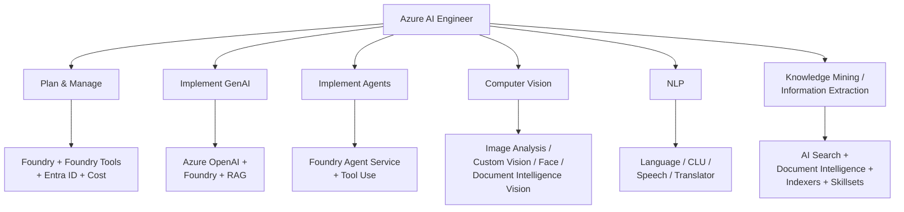

# Microsoft Certified: Azure AI Engineer Associate (AI-102)

> This is the **official certification page** for the Azure AI Engineer Associate. It defines the role, the assessed skills, and exam logistics. **Important for your study plan: the page now carries a retirement banner** — the certification and its renewal assessment are retired. You're studying this for historical / portfolio / job-market currency, not for a fresh cert. Target audience: AI engineers who build and ship AI solutions on Azure using Foundry Tools, AI Search, and Azure OpenAI.

## ⚠️ Retirement Status
- The cert page displays: **"This certification and the renewal assessment are retired."**
- Background: AI-102 was retired **June 30, 2026**. The skill set is being absorbed into newer role-based credentials and Microsoft Applied Skills badges.
- Studying AI-102 still makes sense for: job-market resume keywords, interviews that reference it, internal upskilling, and as a foundation for the replacement credentials.

## 🎯 Role Definition (from the cert page)
> "As a Microsoft Azure AI engineer, you build, manage, and deploy AI solutions that leverage Azure AI."

Responsibilities across the full lifecycle:
- Requirements definition and design
- Development
- Deployment
- Integration
- Maintenance
- Performance tuning
- Monitoring

You collaborate with **solution architects** (translating their vision) and **data scientists, data engineers, IoT specialists, infrastructure admins, and other developers** to build complete end-to-end AI solutions and integrate AI into other applications.

### Required language skills
- **Python** and **C#** are the two explicitly called out.
- Must be comfortable with **REST APIs and SDKs**.

### Required Azure portfolio knowledge
- Components of the Azure AI portfolio (Foundry, Foundry Tools, Azure OpenAI, AI Search).
- Available **data storage options** (Blob, Data Lake, Cosmos DB, etc.).
- **Responsible AI principles** applied in practice.

## 📦 What the Exam Assesses (the 6 domains)
| # | Domain | Weight feel |
|---|---|---|
| 1 | **Plan and manage an Azure AI solution** | ~20% |
| 2 | **Implement generative AI solutions** | ~15-20% |
| 3 | **Implement an agentic solution** | ~10-15% (newer addition) |
| 4 | **Implement computer vision solutions** | ~15% |
| 5 | **Implement natural language processing solutions** | ~15% |
| 6 | **Implement knowledge mining and information extraction solutions** | ~15% |

(Domain weights shift per exam update — verify against the most recent skills measured PDF before sitting the exam. The six domain headings above are verbatim from the cert page.)

## 🔧 Exam Logistics
- **Duration:** 100 minutes
- **Format:** Proctored, includes interactive (lab) components
- **Languages:** English, Japanese, Chinese (Simplified), Korean, German, French, Spanish, Portuguese (Brazil), Chinese (Traditional), Italian
- **Retake policy:** 24 hours after 1st attempt; longer waits for subsequent attempts.
- **Accommodations** available.

## 🔌 Prerequisites / Adjacent Certs
- **Azure Fundamentals (AZ-900)** is the typical recommended (not required) starting point.
- **Azure AI Fundamentals (AI-900)** is a useful warm-up — overlaps in Foundry Tools concepts but is less implementation-focused.
- Common next step after AI-102: **Azure Solutions Architect Expert (AZ-305)**, **Azure Developer Associate (AZ-204)**, or **Microsoft Applied Skills** badges in targeted areas.

## ⚠️ Exam-Relevant Notes
- This is the canonical **"what does an Azure AI Engineer do"** document — read it once at the start of your study plan and again before the exam.
- The six domains map cleanly to the modules in the AI-102 learning path. Treat each domain as a study unit.
- "**Implement an agentic solution**" is the newest domain — reflects the shift toward Foundry-based agent / copilot patterns. For legacy study material, this is the area to supplement with the latest Foundry agent docs.
- Branding chain to memorize: **Cognitive Services → Azure AI Services → Foundry Tools / Microsoft Foundry** — the cert page itself still references "Azure AI services" and "Azure AI Search" in the certification tagline.
- Even though the cert is retired, the **skills measured** document is still the single best study outline you can get for free.
- The page advertises a **Practice Assessment** (`assessmentId=61`) and an **Exam Sandbox** (look-and-feel demo) — both still valuable for last-mile prep.

## 🧠 Visual

## 📚 Source
- Original URL: https://learn.microsoft.com/en-us/credentials/certifications/azure-ai-engineer/
- Final URL: same (no redirect)
- Page last updated: 2025-12-23
- Level: Intermediate · Product: Azure · Role: AI Engineer · Subject: Artificial Intelligence
- **Status: Retired** (per page banner, 2026)

---

📚 Source: Obsidian Vault snapshot from 2026-07-29. Part of the [AI-102 study pack](../00 - AI-102 Study Guide.md). Exam AI-102 was retired 2026-06-30 — these notes are preserved for portfolio + Microsoft Foundry competency reference.
