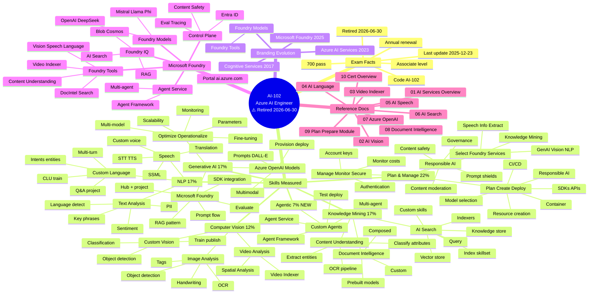

# AI-102 · Microsoft Azure AI Engineer · Master Mind Map

---

## How to read this map

The mind map has **5 main branches** under the root:

1. **Exam Facts** — Code, score, level, renewal, retirement date
2. **Skills Measured** — The 6 functional groups with weights and sub-skills
3. **Branding Evolution** — The 3-name rebrand history
4. **Microsoft Foundry** — The current platform architecture
5. **Reference Docs** — Quick links to the 10 crawled notes

For **studying**: start at **Skills Measured** → drill into each functional group.
For **portfolio**: use **Branding Evolution** to show you understand the current naming.
For **interview prep**: read **Microsoft Foundry** to know the platform.

---

Rendered with Mermaid 10+ · Compatible with GitHub, Obsidian, VS Code, Notion
